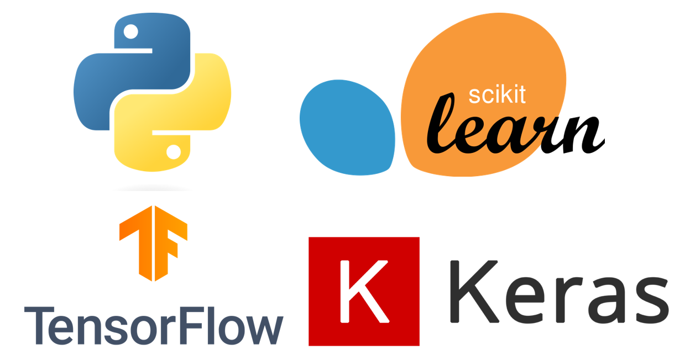

# Machine-Learning-basics
This is a basic  repository which contains a simple application of `machine learning` algorithms such as simple and multiple linear regression, classification algorithms (logistic regression, decision tree, random forest, Naive Bayes, KNN, Artificial Neural Networks, SVM .....) and clustering (K-means , Hierarchical Clustering ...)also some `statistical methods` for `data analysis` like principal component analysis (PCA), Correspondence Analysis (CA) ...

---

---
This repository is designed to be accessible to beginners in the field of machine learning and data analysis. It provides code examples and explanations to help users understand and use these basic techniques in their own projects.

In this repository, I mainly used the `Python` programming language , `Scikit-learn` (a free Python library for machine learning) , tensorflow and keras (a free Python libraries for deep learning)

---

